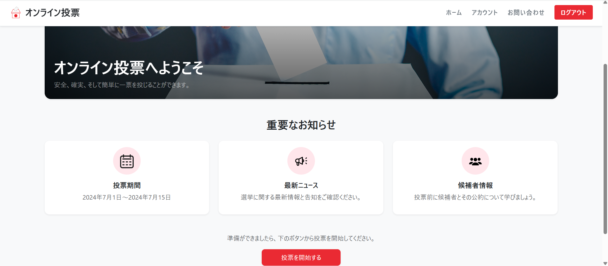

# README

# オンライン投票アプリ

## 1. サービス概要
安全・簡単・確実に投票できるオンライン選挙システムです。  

---

## 2. サービス画像

---

## 3. サービスURL
🔗 [本番環境はこちら](https://online-voting-app-kaito-new-07e23065ff59.herokuapp.com)
【ユーザー】
Eメール:user@example.com
パスワード:password

【管理者】
Eメール:admin@example.com
パスワード:password123

---

## 4. サービスの概要
本サービスは、オンラインで投票が完結するシステムを目指して開発されました。  
ユーザーはログイン後、選挙の一覧や候補者の情報を確認し、簡単に投票することができます。  
有権者はWeb上から候補者情報を確認し、投票を行うことができます。  
管理者は選挙や候補者を作成・編集・削除し、投票結果を確認することができます。

---

## 5. 開発背景
- オフライン投票では時間や場所の制約が大きく、投票率が下がる課題がある
- オンライン投票を導入することで、より多くの人が簡単に投票に参加できるようにしたい
- 学習目的でRailsを使ったWebアプリ開発を経験するために作成

---

## 6. 機能一覧

### 👤 ユーザー機能
- ホーム画面（お知らせ表示、投票開始ボタン）
- ログイン / ログアウト（Devise）
- 選挙一覧ページ（選挙スケジュール確認）
- 候補者ページ（候補者情報表示）
- 投票ページ（投票の実行）

### 🛠 管理者機能
- 選挙作成 / 編集 / 削除
- 候補者作成 / 編集 / 削除
- 投票結果の集計・確認

---

## 7. 主な使用技術
- **言語**: Ruby 3.1.5
- **フレームワーク**: Ruby on Rails 6.1.7
- **フロントエンド**: ERB, SCSS, JavaScript, Bootstrap 5
- **認証**: Devise
- **データベース**: PostgreSQL
- **デプロイ**: Heroku
- **その他**: ActiveStorage（画像アップロード）

---

## 8. ER図
+--------------------+       +--------------------+       +--------------------+
|      users         |       |      elections      |       |     candidates     |
+--------------------+       +--------------------+       +--------------------+
| id (PK)            |<----->| id (PK)            |<----->| id (PK)            |
| email              |       | title              |       | name               |
| encrypted_password |       | description        |       | party              |
| name               |       | start_at           |       | policy             |
| verification_id    |       | end_at             |       | election_id (FK)   |
| voted              |       | created_at         |       | created_at         |
| admin              |       | updated_at         |       | updated_at         |
| identification_no  |       +--------------------+       +--------------------+
| role               |
+--------------------+

         | 1                       1..*                 1..*
         |                                          
         |                                          
         v                                          
+--------------------+                               
|       votes        |                               
+--------------------+                               
| id (PK)            |                               
| user_id (FK)       |-----------------------------> users.id
| candidate_id (FK)  |-----------------------------> candidates.id
| election_id (FK)   |-----------------------------> elections.id
| created_at         |
| updated_at         |
+--------------------+

+----------------------------+
| active_storage_blobs       |
+----------------------------+
| id (PK)                    |
| key                        |
| filename                   |
| content_type               |
| metadata                   |
| service_name               |
| byte_size                  |
| checksum                   |
| created_at                 |
+----------------------------+

+----------------------------+
| active_storage_attachments |
+----------------------------+
| id (PK)                    |
| name                       |
| record_type                |
| record_id                  |
| blob_id (FK) --------------> active_storage_blobs.id
| created_at                 |
+----------------------------+

+-------------------------------+
| active_storage_variant_records|
+-------------------------------+
| id (PK)                       |
| blob_id (FK) -----------------> active_storage_blobs.id
| variation_digest               |
+-------------------------------+

## 9. 今後の展望
- **直近の修正予定**
  - UI改善（レスポンシブ対応、デザイン調整）
  - バリデーションエラーメッセージの見やすさ改善

- **短期的な目標**
  - 投票結果のグラフ表示
  - 候補者検索機能の強化

- **中期的な目標**
  - 多言語対応
  - 投票認証の強化（2段階認証）
  - 大規模利用を想定したパフォーマンス改善
